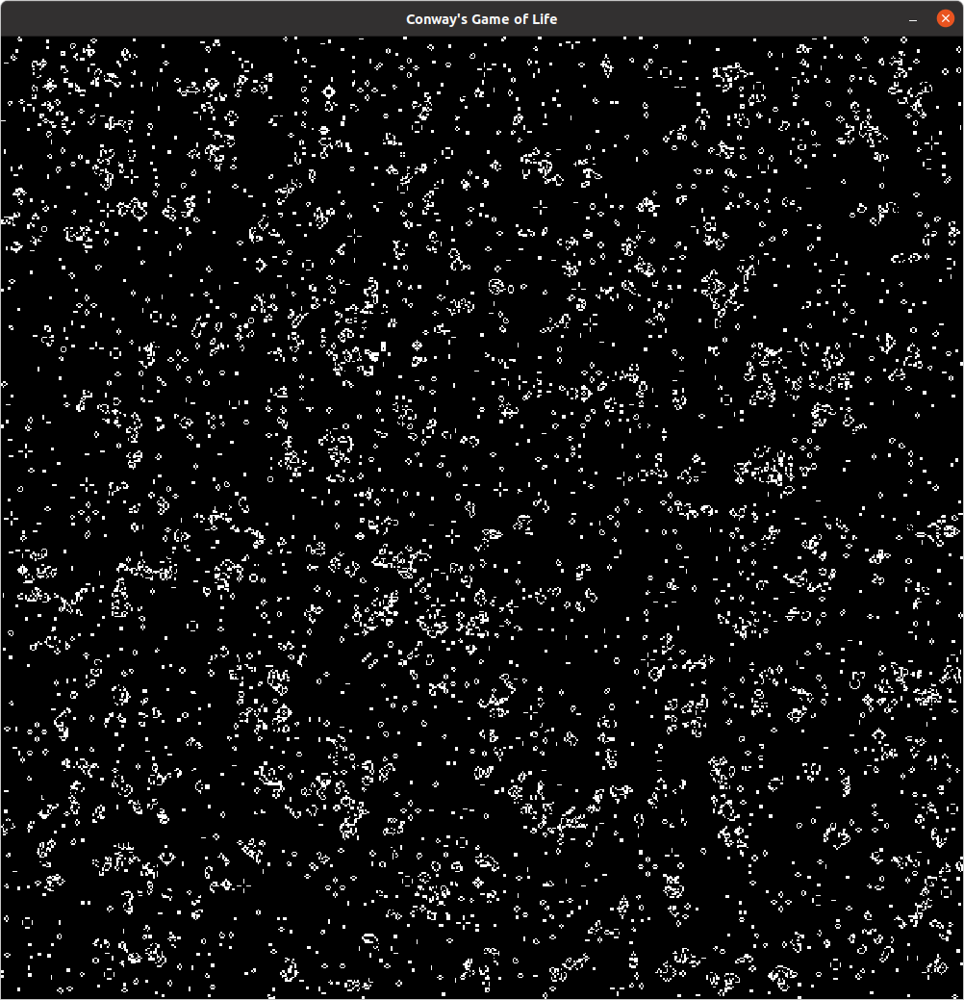

# conways_game_of_life
A simple implementation of Conway's Game of Life, rendered via SDL.

The game's implementation is found in the class GameOfLife in gameoflife.h/gameoflife.cpp. Each cell has a state consisting of 8 bit. The rightmost bit is used to store the dead/alive state, while the other bits are used to store the number of neighbours for each cell.

The example in main generates a uniformly distributed grid of cells of states alive or dead. After 5 seconds, the game starts.

